<p align="center">
  
</p>

<p align="center">
  
  
  
  
  
</p>

O **Hive** resolve um problema concreto de cidade universitária: encontrar moradia perto da faculdade é lento, espalhado por grupos de WhatsApp e sem garantia nenhuma de quem está do outro lado. O app reúne isso num mapa, com perfis distintos para cada lado da negociação e comunicação direta dentro da própria plataforma.

<p align="center">
  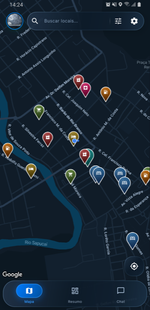
  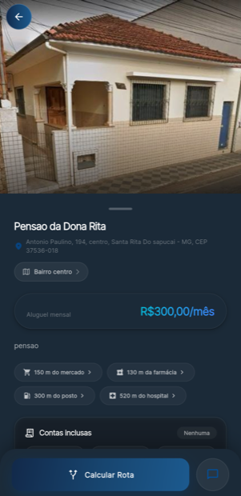
  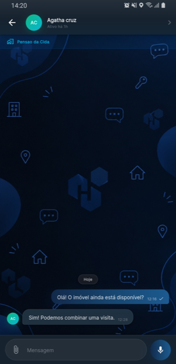
</p>

<p align="center"><sub>Mapa da cidade, ficha do anúncio e conversa com o anunciante</sub></p>

---

## ✨ Funcionalidades

### 🗺️ Mapa e busca

O mapa é a tela principal: abre na posição do usuário e mostra, ao vivo, tudo que está anunciado na região.

- Moradias e **eventos** no mesmo mapa, com pin próprio para cada categoria
- **Mercado, farmácia, posto, hospital e hotel** ao redor, vindos do Places, para dar contexto de vizinhança
- Busca híbrida numa barra só: locais conhecidos, anúncios do sistema e, logo depois, ruas e bairros de verdade. Rua vira linha destacada no mapa e bairro vira área
- Filtro de moradia (preço, tipo, características, contas inclusas) separado do filtro de **o que aparece no mapa**
- "Perto de" medido pela distância real até o lugar, não pelo que o anunciante achou que era perto
- Painel da faculdade com galeria, cursos e atalho para o vestibular
- Estilo próprio de mapa no claro e no escuro, mais alternância entre **Normal e Satélite**

<p align="center">
  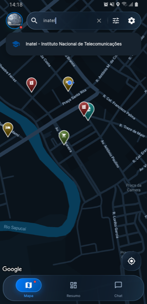
  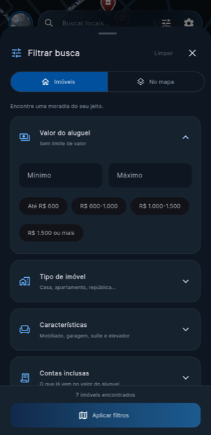
  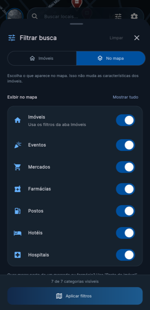
  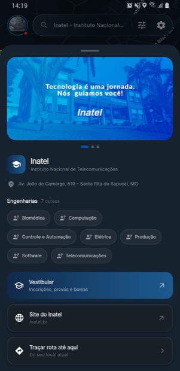
</p>

### 🏠 Anúncios

- Ficha completa: fotos, aluguel, IPTU, bairro, contas inclusas e características
- Distância até mercado, farmácia, posto e hospital calculada na própria ficha
- Lista em cards na aba **Resumo**, com separação entre moradias e eventos
- Cadastro com endereço estruturado, CEP preenchido sozinho pelo ViaCEP e geocodificação do endereço digitado
- Painel **Meus Imóveis** para proprietário e corretor acompanharem os próprios anúncios ao vivo
- **Anúncio abandonado sai do mapa sozinho**: cinco meses com mensagem sem resposta e ele deixa de aparecer para quem procura, com aviso e prazo no painel do anunciante desde um mês antes. Responder traz o anúncio de volta na hora

<p align="center">
  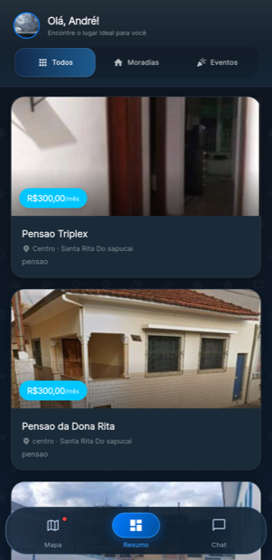
  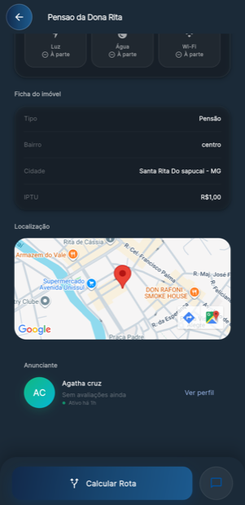
</p>

### 🧭 Rota até o imóvel

- Rota da sua posição até o anúncio, ou do anúncio até qualquer destino digitado
- **Alternativas de trajeto** lado a lado, com a diferença de tempo entre elas
- Carro, a pé, bicicleta, moto e ônibus
- Modo navegação: a câmera segue a pessoa pelo trajeto e gira junto com ela

<p align="center">
  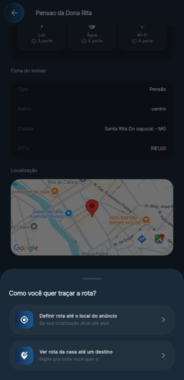
  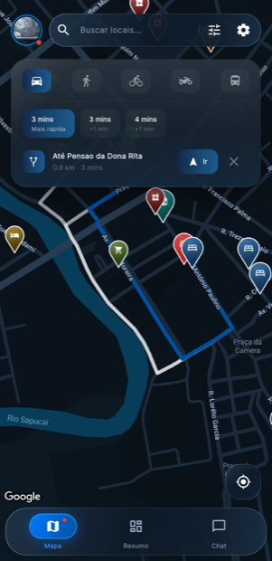
</p>

### 💬 Conversa

- Chat privado entre o interessado e o anunciante, **uma conversa por interessado** e não uma sala por anúncio
- Envio de fotos e de **mensagens de áudio**, gravadas e ouvidas na própria bolha, com até dois minutos cada
- Caixa de entrada com prévia da última mensagem, contador de não lidas por conversa e busca de pessoas e imobiliárias
- Avisos dentro do app (novo anúncio, nova imobiliária, nova avaliação, resposta de vínculo) em tempo real, sem depender de servidor

<p align="center">
  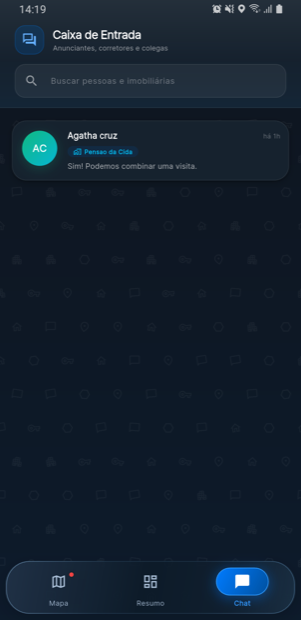
  
  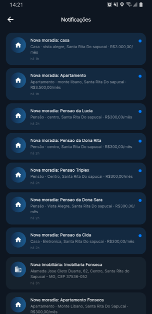
</p>

### 👤 Perfis e confiança

- Três tipos de conta - **estudante, proprietário e corretor** - cada um com fluxos próprios
- Login por e-mail/senha ou conta Google, com confirmação de e-mail obrigatória
- CPF e CNPJ conferidos pelo dígito verificador; nome passa por moderação
- Perfil público separado do perfil privado: busca, chat e avaliações não expõem dado pessoal
- **Avaliações** entre usuários e de imobiliárias
- Vínculo entre corretor e imobiliária aprovado pela própria empresa
- Anúncio liberado apenas para quem completou o perfil

<p align="center">
  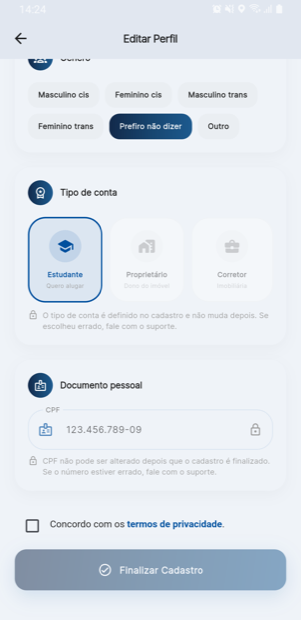
</p>

### 🎨 Tema

Claro, escuro ou seguindo o sistema - e o mapa acompanha, com estilo desenhado para cada modo.

<p align="center">
  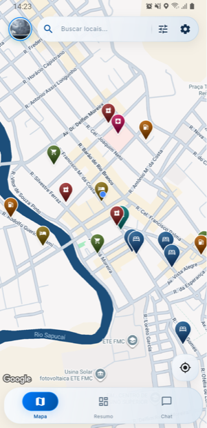
  
</p>

---

## 🏗️ Arquitetura

O código é organizado por responsabilidade, não por tela:

```
lib/
├── main.dart              # ponto de entrada, tema global e design tokens
├── firebase_options.dart  # configuração gerada pelo FlutterFire CLI
├── models/                # entidades do domínio (usuário, imóvel, avaliação...)
├── screens/               # telas, uma por fluxo de usuário
├── services/              # acesso a Firestore, Auth e APIs externas
├── widgets/               # componentes reutilizáveis de interface
└── utils/                 # formatadores, validadores e helpers
```

A regra que mantém isso limpo: **tela não fala com o Firebase direto** - sempre passa por `services/`. Trocar a fonte de dados não obriga a mexer na interface.

O estado compartilhado usa `ValueNotifier` global (tema, pedido de rota, notificações), sem pacote de gerenciamento de estado. O projeto **não tem Cloud Functions**: o que precisaria de servidor é calculado na leitura, dentro do app, e garantido pelas regras do Firestore.

---

## 🔒 Segurança

As permissões ficam nas regras do Firebase, versionadas junto com o código em `firestore.rules` e `storage.rules`:

- Dados sensíveis (CPF, endereço, telefone) só são lidos e escritos pelo próprio dono
- Perfil público separado do privado, para busca e chat não exporem dado pessoal
- CPF, CNPJ e tipo de conta ficam **imutáveis** depois que o cadastro é finalizado: são o que identifica a pessoa em anúncio, chat e avaliação
- Anúncio só pode ser criado por quem completou o perfil, e só o dono edita ou apaga
- Avaliação não pode ser publicada em nome de outra pessoa
- **Conversa só é lida e escrita pelas duas pessoas dela**, e ninguém assina mensagem em nome de outra
- O prazo de resposta de um anúncio só é iniciado por quem realmente abriu conversa nele, com a data do servidor - ninguém derruba do mapa o anúncio de um concorrente

---

## 🧪 Testes

Os testes de unidade e de widget rodam direto:

```bash
flutter test
```

As regras do chat são as mais fáceis de quebrar sem perceber, porque o app
continua funcionando para quem participa da conversa mesmo quando ela está
aberta para todo mundo. Por isso elas têm teste próprio, rodado contra o
emulador do Firestore:

```bash
cd test/rules && npm install && cd ../..
firebase emulators:exec --only firestore "node test/rules/chats.test.mjs"
```

O prazo de resposta é o único caso do app em que alguém escreve num anúncio
que não é seu, então ele tem o teste dele pelo mesmo motivo - o app continua
funcionando igual mesmo que a regra esteja larga demais:

```bash
firebase emulators:exec --only firestore "node test/rules/prazo-resposta.test.mjs"
firebase emulators:exec --only firestore "node test/rules/cadastro.test.mjs"
```

---

## 🚀 Tecnologias

| Camada | Ferramentas |
|---|---|
| App | Flutter 3.41 · Dart 3.11 |
| Autenticação | Firebase Auth · Google Sign-In |
| Banco de dados | Cloud Firestore |
| Mapas | Google Maps · Places · Directions · Geocoding · Geolocator · Polyline Points |
| Busca de endereço | Nominatim · Overpass · ViaCEP |
| Mídia | Image Picker · Record · AudioPlayers · ImgBB |
| Plataforma | Android |

---

## 🛠️ Como executar

**Pré-requisitos:** Flutter 3.41 ou superior e um projeto Firebase próprio.

**1.** Clone o repositório:

```bash
git clone https://github.com/Alves-Araujo/hive.git
cd hive
```

**2.** Instale as dependências:

```bash
flutter pub get
```

**3.** Configure seu próprio Firebase - as credenciais deste repositório apontam para o projeto original:

```bash
dart pub global activate flutterfire_cli
flutterfire configure
```

**4.** Coloque sua chave da API do Google (Maps, Places e Directions) nos dois lugares em que ela é lida:

- `android/app/src/main/AndroidManifest.xml`, em `com.google.android.geo.API_KEY`
- `lib/main.dart`, na constante `googleMapsApiKey`

**5.** Troque a chave do ImgBB em `lib/services/imgbb_service.dart` pela sua, se for subir fotos de anúncio e de perfil.

**6.** Publique as regras de segurança no seu projeto:

```bash
firebase deploy --only firestore:rules,storage:rules
```

**7.** Rode o app:

```bash
flutter run
```

---

## 📌 Status

Em desenvolvimento ativo. Rodando em **Android**, que é a única plataforma suportada no momento: o suporte a iOS foi removido do projeto e será retomado mais pra frente. A estrutura de monitorias já está preparada no modelo e nas regras, mas ainda não foi implementada na interface.

---
